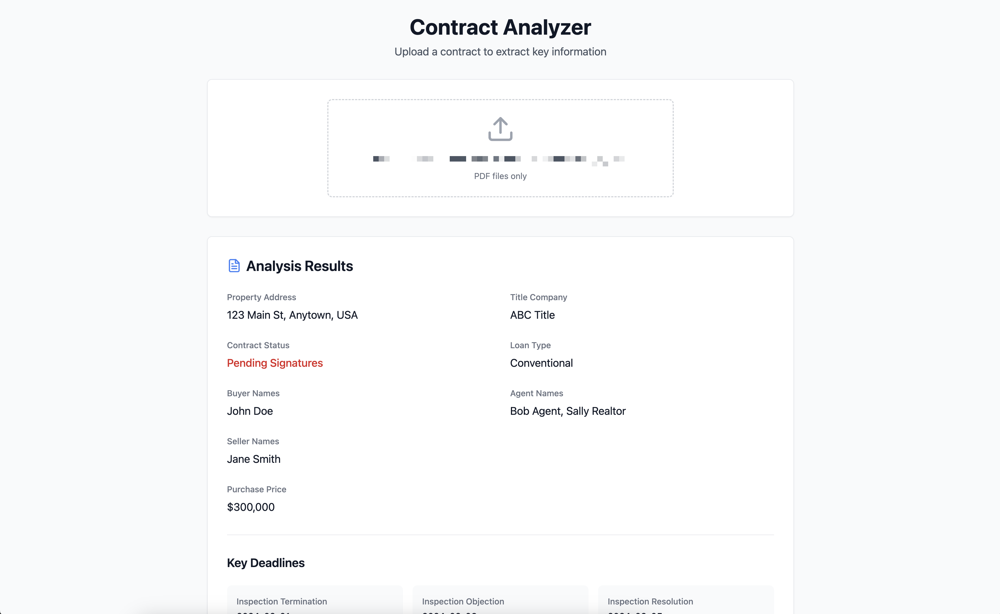
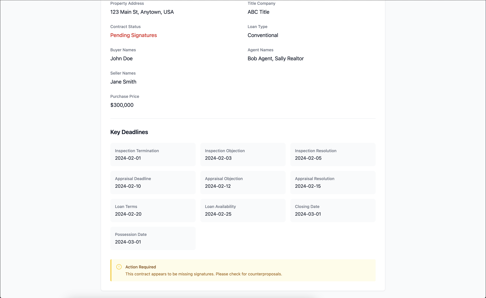

# Contract Analyzer

A React application that analyzes real estate contracts using OpenAI's GPT-4. Upload a PDF contract and get key information extracted including property details, signatures, deadlines, and more.

## Demo Screenshots - v1

### Screenshot 1: Uploading a PDF



### Screenshot 2: Analysis Results



## Setup

1. Clone the repository
1. Install dependencies:

```bash
npm install
cd server
npm install
```

1. Create a `.env` file in the server directory:

```bash
PORT=3001
OPENAI_API_KEY=your_openai_api_key_here
```

## Running the Application

You need to run both the frontend and backend servers:

### Frontend Server

From the project root:

```bash
npm start
```

Frontend runs on <http://localhost:3000>

### Backend Server

In a new terminal window, from the project root:

```bash
cd server
node index.js
```

Backend runs on <http://localhost:3001>

## Key Features

- PDF contract upload and analysis
- Extraction of:
  - Property Address
  - Signature Status
  - Buyer/Seller Names
  - Purchase Price
  - Title Company
  - Loan Type
  - Agent Names
  - Key Deadlines

## Tech Stack

- React
- Node.js/Express
- OpenAI GPT-4
- Tailwind CSS
- pdf-parse for PDF processing

## Notes

- Requires an OpenAI API key
- Only processes PDF files
- Make sure both servers are running for full functionality
